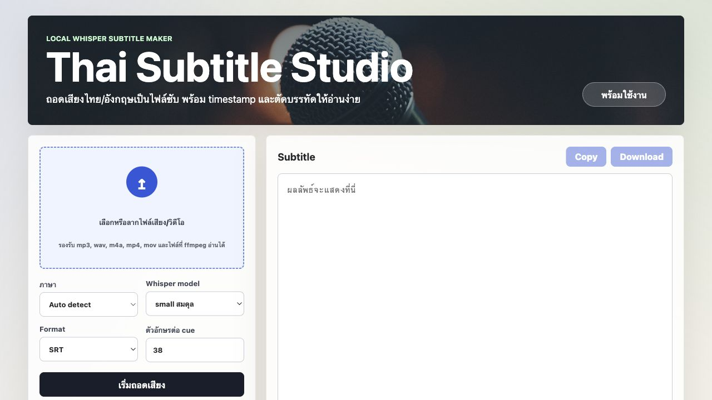

# Thai Subtitle Studio

โปรแกรมถอดเสียงเป็นซับไตเติล รองรับภาษาไทยและอังกฤษ รันในเครื่องตัวเอง ใช้ Whisper ฟรี และ export เป็นไฟล์ `SRT` / `VTT`



## วิธีรัน

ดาวน์โหลดหรือ clone โปรเจกต์นี้ แล้วกดไฟล์ตามระบบที่ใช้

### macOS

เปิด Terminal ในโฟลเดอร์โปรเจกต์ แล้วรันครั้งแรก:

```bash
chmod +x RUN-MAC.command start-mac.command setup-mac-linux.sh run-mac-linux.sh
./RUN-MAC.command
```

ครั้งต่อไปกดไฟล์นี้ได้เลย:

```text
RUN-MAC.command
```

### Windows

ดับเบิลคลิกไฟล์นี้:

```text
RUN-WINDOWS.bat
```

จากนั้นเปิดเว็บ:

```text
http://127.0.0.1:5173
```

## ต้องมีในเครื่อง

- Node.js 20+
- Python 3.10+
- ffmpeg

ถ้ายังไม่มี ให้ติดตั้งก่อน

macOS:

```bash
brew install node python ffmpeg
```

Windows:

```powershell
winget install OpenJS.NodeJS Python.Python.3.12 Gyan.FFmpeg
```

## เลือกโมเดลไหนดี

- `small`: เบา ใช้งานทั่วไป
- `medium`: แม่นขึ้น
- `turbo`: เร็วและแม่น แนะนำให้ลองก่อน
- `large-v3`: แม่นสุด แต่ช้าและกินเครื่องกว่า

ครั้งแรกที่เลือกโมเดล อาจรอนาน เพราะ Whisper ต้องดาวน์โหลดโมเดลก่อน
